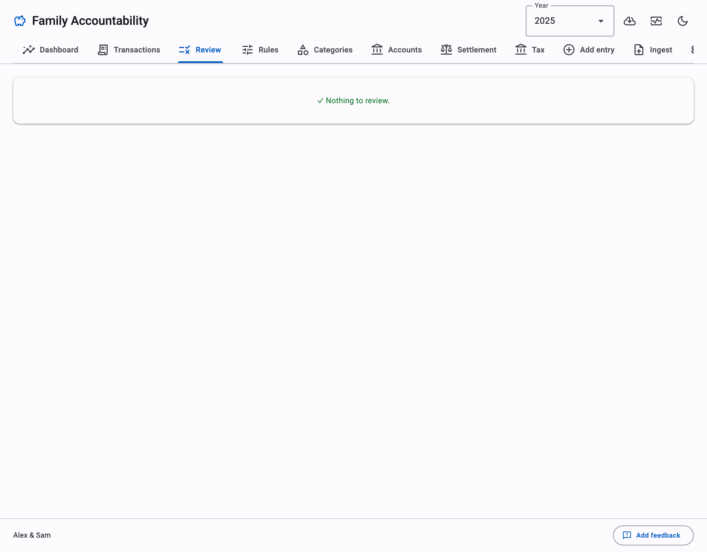
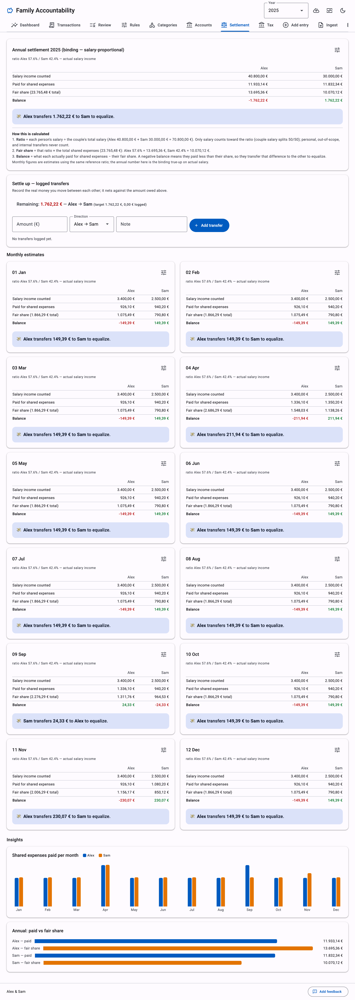

# UnPAIN

**Un**necessarily **P**recise **A**ccounting & **I**ncome **N**avigator

[](https://github.com/leandrorsampaio/unpain/actions/workflows/tests.yml)
[](LICENSE)

> **We don't simplify your finances. We simplify managing your complicated finances.**

If you have ever exported your bank statements into a spreadsheet, built your own categories, and
colour-coded a pivot table at 1 a.m. — this was built for you.

UnPAIN is a self-hosted expense tracker for people who already track everything. It is not here to
replace YNAB, Mint, Monarch, Actual Budget, or Firefly III. It is here for the person who tried all
of those and quietly went back to Excel, because none of them fit the way they think about money.

We are not trying to simplify your finances. We are trying to make your already-complicated finances
*manageable* — without giving up a single decimal.

Yes, this is probably more detailed than necessary. That is the point. **Proudly unnecessary.**


## Is this you?

UnPAIN is for people who:

- care where every cent went
- enjoy a detailed financial report the way other people enjoy a good book
- compare spending month over month, and year over year
- keep many spending categories and defend every one of them
- save receipts
- like dashboards
- still live in spreadsheets
- believe budgeting should *answer questions*, not just show a balance

It is especially good for **couples** who want a genuinely fair way to split expenses — proportional
to income, not a lazy 50/50.

If you live in **Germany**, it also quietly organizes your tax-relevant expenses all year, so tax
season stops being a shoebox emergency.

If none of that sounds like you, that is fine. This probably is not your tool, and we are at peace
with that.

## What makes it different

**Automation that respects your obsession.** UnPAIN does not try to think for you. It removes the
boring part. You should never categorize the same supermarket 300 times. Teach it a merchant once,
and it remembers forever.

**Your data never leaves your machine.** No cloud. No telemetry. No subscription. No login. You own
your financial history — today and in ten years.

**Fair, not equal.** Shared costs split in proportion to income. When two people earn differently,
50/50 is not fair. It just looks tidy.

**A German tax bonus.** This is not the main product. It is a gift for people living in Germany.
UnPAIN sorts refund-relevant spending into the right buckets (Werbungskosten, Sonderausgaben, §35a)
all year, ready for ELSTER or a Steuerberater. Everyone else ignores this layer.

**Open source, on purpose.** This is not a licence footnote. Owning your financial data forever is
the whole philosophy. The code is yours to read, run, and keep.

|  |  |
|---|---|
|  |  |

## Why it exists

We built UnPAIN for our own household. Every tool we tried eventually lost to a spreadsheet. The
spreadsheet then became unmanageable. So we built the thing we actually wanted: a spreadsheet's
precision, without a spreadsheet's chaos.

We know this is excessive. We built it anyway.

---

*The rest of this file is the manual. If you are still reading, you are definitely one of us.*

## Quick start

```bash
git clone <repo-url> && cd unpain
./start.sh            # creates a Python 3.12 venv on first run, then starts the app
```

Open http://localhost:8765. A **setup wizard** asks for your two names and creates the first
configuration.

To reach the app from another device on your home network, run `./start.sh --lan`. This binds all
interfaces. Do this only on a network you trust, because the app has no login.

On Windows, run these commands:

```
py -3.12 -m venv .venv
.venv\Scripts\pip install -r requirements.txt
.venv\Scripts\uvicorn app.server:app --port 8765
```

To look around first, run `./start.sh --demo`. It seeds an isolated `demo/` folder with five years
of synthetic data (Alex and Sam) and serves it. Your real data stays untouched.

## Monthly workflow

1. Download the CSV export from each bank. Name each file `<account-id>__anything.csv`. The account
   ids come from the Accounts tab. Drop the files in `inbox/`. PDF-only sources go through the
   deterministic extractors on the Ingest page.
2. Click **Ingest inbox**. Then work through the **Review** tab. "Apply + rule" teaches the system
   permanently. After a few months, almost everything categorizes itself.
3. Check the Dashboard. Then click **Close month**.

A new year needs no setup. Transactions go into `data/<year>/` by their date. Your rules and
categories carry over automatically.

## Add your bank

CSV parsing is configuration, not code. Each format is one JSON file in `pipeline/formats/`. It maps
the bank's headers to fields (delimiter, decimal style, date format). If UnPAIN does not recognize
your export, the ingest error prints the headers it saw. Copy an existing format file and adjust it.
PRs with new bank formats are the most welcome kind.

## Command line (optional)

The web app is the main interface. The same pipeline is also scriptable:

```bash
.venv/bin/python -m pipeline.cli ingest        # process inbox/
.venv/bin/python -m pipeline.cli status        # review counts per year
.venv/bin/python -m pipeline.cli settle 2026   # annual settlement (add --month 6 for an estimate)
.venv/bin/python -m pipeline.cli tax 2026      # tax evidence pack JSON
.venv/bin/python -m pipeline.cli fx-update     # refresh ECB rates (needed once for non-EUR)
.venv/bin/python -m pipeline.cli doctor        # read-only data integrity audit
```

## How it works (the short version)

> For a visual walkthrough, open [`how-it-works.html`](how-it-works.html) in a browser.

- **Deterministic core.** Parsing, categorization rules, FX, settlement, and tax math are plain
  Python. UnPAIN recomputes them from source data and your decisions. It never stores derived
  values.
- **Optional LLM at the edges.** `skills/` contains instructions that any CLI agent (Claude Code,
  Gemini CLI) can run. An agent proposes categorization rules for unseen merchants, or extracts
  PDF-only statements. A balance reconciliation gates every extraction (`opening + sum == closing`
  to the cent, or UnPAIN rejects the data). No API keys and no vendor lock-in. The app is fully
  usable without any LLM.
- **Fairness model.** Only salary counts toward the income ratio. UnPAIN computes the binding
  settlement after Dec 31 from actual annual income. Personal and out-of-scope expenses never enter
  the split.

## Data, privacy, and backups

Everything stays in this folder: `data/` (transactions, decisions), `rules/` (your learned
categorization), and `config.json`. Git ignores all of it. The in-app Backup button zips it. Back it
up yourself, because git does not carry your data, and there is no server-side copy to recover from.

## Development

```bash
npm install && npx playwright install chromium   # browser smoke test (dev only)
git config core.hooksPath .githooks
./run-tests.sh
```

Stack: Python 3.12 and FastAPI, vanilla JS with vendored Material Design 3 components. There is no
build step, and it is fully offline. Agents and contributors start at [PROJECT.md](PROJECT.md) and
[CONTRIBUTING.md](CONTRIBUTING.md).

## Status and licence

We built UnPAIN for our own household and share it as-is. Issues and PRs are welcome. There is no
support promise, and no roadmap beyond what we need ourselves. License: MIT (see LICENSE).

## Hi, I'm Leandro 👋

I'm a software engineer living in Germany.

For years, my wife and I ran our household finances on increasingly elaborate Excel spreadsheets.
Every finance app solved part of the problem. None solved all of it. Eventually the spreadsheet got
more complicated than the software I write for a living — so I built UnPAIN.

It's open source because I suspect I'm not the only person who enjoys knowing exactly where every
cent went. If that's you, hello. This was built by someone exactly like you.

## 🍺 Buy me a beer

UnPAIN is a passion project. There is no company here — just me, a spreadsheet problem, and a
weekend that got a little out of hand.

It's completely free. No subscriptions. No premium tier. No ads. No tracking.

If UnPAIN saved you time, saved you money, or simply made managing your finances a little more
enjoyable, buying me a beer is a lovely way to say thanks — and it helps fuel another weekend of
unnecessary precision.

[](https://buymeacoffee.com/lsampaio)

No pressure, though. The app is yours either way.
