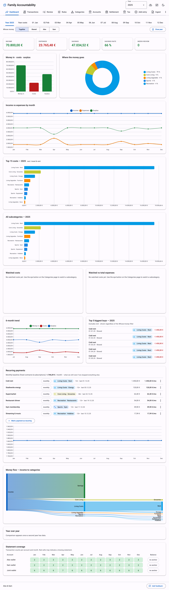

# Family Accountability

[](https://github.com/leandrorsampaio/FamilyAccountability/actions/workflows/tests.yml)
[](LICENSE)

A self-hosted, offline-first expense tracker for **two-person households**: drop your banks'
CSV exports in a folder, review a small queue in the browser, and get monthly/yearly
dashboards, an income-proportional fairness settlement between partners, and a German tax
evidence pack. Your financial data never leaves your machine.



## Who this is for

- Couples who want shared costs split **proportionally to income**, with a binding yearly
  true-up (and a monthly estimate along the way).
- People in the euro area: EUR is the base currency; foreign-currency accounts (USD, BRL,
  CHF, … any ECB reference currency) are converted at the ECB rate of the transaction date.
- People in Germany get a bonus: a year-end tax evidence pack (Werbungskosten, Sonderausgaben,
  §35a, …) ready for ELSTER or a Steuerberater. Everyone else can ignore or reseed the tax layer.
- People comfortable running one local command. There is no cloud, no account, no telemetry —
  and also no login: run it on localhost or a network you trust.

## Quick start

```bash
git clone <repo-url> && cd FamilyAccountability
./start.sh            # creates a Python 3.12 venv on first run, starts the app
```

Open http://localhost:8765 — a **setup wizard** asks for your two names and creates the
initial configuration. To reach it from another device on your home network, run
`./start.sh --lan` (binds all interfaces — only do this on a network you trust, since the app
has no login). Windows: `py -3.12 -m venv .venv`,
`.venv\Scripts\pip install -r requirements.txt`, then
`.venv\Scripts\uvicorn app.server:app --port 8765`.

Just want to look around first? `./start.sh --demo` seeds an isolated `demo/` folder with five
years of synthetic data (Alex & Sam) and serves it — your real data is never touched.

## Monthly workflow

1. Download CSV exports from each bank, name them `<account-id>__anything.csv` (account ids
   come from the Accounts tab), drop them in `inbox/`. PDF-only sources go through the Ingest
   page's deterministic extractors.
2. Click **Ingest inbox**, then work through the **Review** tab. "Apply + rule" teaches the
   system permanently — after a few months almost everything categorizes itself.
3. Check the Dashboard, then **Close month**.

Adding a new year needs nothing: transactions land in `data/<year>/` by their date, and your
rules and categories carry over automatically.

## Adding your bank

CSV parsing is config, not code: each format is a JSON file in `pipeline/formats/` mapping
the bank's headers to fields (delimiter, decimal style, date format). If your export isn't
recognized, the ingest error prints the headers it saw — copy an existing format file and
adjust. PRs with new bank formats are the most welcome kind.

## Command line (optional)

The web app is the main interface, but the same pipeline is scriptable:

```bash
.venv/bin/python -m pipeline.cli ingest        # process inbox/
.venv/bin/python -m pipeline.cli status        # review counts per year
.venv/bin/python -m pipeline.cli settle 2026   # annual settlement (add --month 6 for estimate)
.venv/bin/python -m pipeline.cli tax 2026      # tax evidence pack JSON
.venv/bin/python -m pipeline.cli fx-update     # refresh ECB rates (needed once for non-EUR)
.venv/bin/python -m pipeline.cli doctor        # read-only data integrity audit
```

## How it works (the short version)

> For a visual walkthrough, open [`how-it-works.html`](how-it-works.html) in a browser.

- **Deterministic core.** Parsing, categorization rules, FX, settlement and tax math are
  plain Python — recomputed from source data + your decisions, never stored derived.
- **Optional LLM at the edges.** `skills/` contains instructions any CLI agent (Claude Code,
  Gemini CLI, …) can run to propose categorization rules for unseen merchants or extract
  PDF-only statements — gated by balance reconciliation (`opening + sum == closing` to the
  cent, or the data is rejected). No API keys, no vendor lock-in; the app is fully usable
  without any LLM.
- **Fairness model.** Only salary counts toward the income ratio; the binding settlement is
  computed after Dec 31 from actual annual income. Personal and out-of-scope expenses never
  enter the split.

## Data & privacy

Everything lives in this folder: `data/` (transactions, decisions), `rules/` (your learned
categorization), `config.json`. All of it is gitignored; the Backup button zips it. Back it
up yourself — git does not carry your data.

## Development

```bash
npm install && npx playwright install chromium   # browser smoke test (dev only)
git config core.hooksPath .githooks
./run-tests.sh
```

Stack: Python 3.12 + FastAPI, vanilla JS with vendored Material Design 3 components, no build
step, fully offline. Agents/LLM contributors: start at [PROJECT.md](PROJECT.md).

## Status & support

Built for our own household, shared as-is. Issues and PRs are welcome, but there is no
support promise and no roadmap beyond what we need ourselves. License: MIT (see LICENSE).
